# home-link

Simulated home sensors communicating over CANopen and OPC-UA, with a C++ bridge and Python tooling on Linux.

## Architecture



A temperature sensor is simulated as a CANopen node broadcasting data over a
virtual CAN bus. A C++ bridge service reads those frames and exposes
the values as OPC-UA nodes. A Python client connects to the OPC-UA server and
displays a live plot of the temperature over time.

## Demo


This demo shows the full pipeline running end to end:

- **Top left terminal** — the mock temperature sensor broadcasting values over CANopen on `vcan0`
- **Top right terminal** — the C++ bridge receiving the CAN frames and exposing them as an OPC-UA node
- **Bottom left terminal** — the Python monitor reading the OPC-UA node and logging the values
- **Right** — the live temperature plot updating in real time

## Requirements / Environment

- Linux with `vcan` kernel module
- Python 3.12+
- CMake
- [open62541](https://github.com/open62541/open62541)

## Setup

### Virtual CAN bus

Run once after every reboot:

```bash
sudo modprobe vcan
sudo ip link add dev vcan0 type vcan
sudo ip link set up vcan0
```

### Python environment

```bash
python3 -m venv .venv
source .venv/bin/activate
pip install -r requirements.txt
```

### C++ bridge

```bash
mkdir build && cd build
cmake ..
make
```

## Running

Components must be started in this order.

1. Start the mock temperature sensor: `python src/sensor_mocks/temp_sensor.py`
2. Start the C++ bridge: `./build/homelink_bridge`
3. Start the live plot: `python src/live_plot.py`
