# home-link

Simulated home sensors communicating over CANopen and OPC-UA, with a C++ bridge and Python tooling on Linux

## Architecture



A temperature sensor is simulated as a CANopen node broadcasting data over a
virtual CAN bus (`vcan0`). A C++ bridge service reads those frames and exposes
the values as OPC-UA nodes. A Python client connects to the OPC-UA server and
displays a live plot of the temperature over time.

| Layer       | Technology                            |
| ----------- | ------------------------------------- |
| Mock sensor | Python, `python-can`, `canopen`       |
| Virtual bus | Linux `vcan` kernel module            |
| Bridge      | C++, `socketcan`, `open62541`         |
| Live plot   | Python, `opcua-asyncio`, `matplotlib` |

## Requirements / Environment

- Linux with `vcan` kernel module
- Python 3.12.3
- CMake and a C++ compiler

## Setup

### Virtual CAN bus

Run once after every reboot:

```bash
sudo modprobe vcan
sudo ip link add dev vcan0 type vcan
sudo ip link set up vcan0
```

### Python environment

```bash
python3 -m venv .venv
source .venv/bin/activate
pip install -r requirements.txt
```

## Running

Components must be started in this order.

1. Start the mock temperature sensor: `python3 sensor/temp_sensor.py`

2. Start the C++ bridge: `./build/casalink_bridge`

3. Start the live plot: `python3 tools/live_plot.py`
